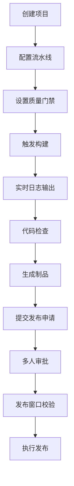
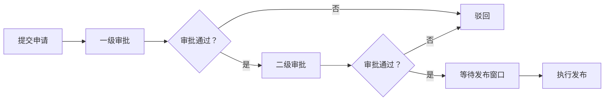

## 1. 产品概述

持续集成平台（CI Platform）是供研发团队管理构建、发布和质量检查的一站式平台。通过可视化流水线编排、自动化构建测试、质量门禁管控、发布审批流程，帮助团队提升研发效率，保障交付质量。

- 目标用户：研发工程师、测试工程师、运维工程师、项目经理
- 核心价值：流水线即代码、可视化编排、质量内建、发布可控

## 2. 核心特性

### 2.1 用户角色

| 角色 | 描述 | 核心权限 |
|------|------|----------|
| 研发工程师 | 代码提交者 | 创建项目、配置流水线、触发构建、查看日志 |
| 测试工程师 | 质量把关者 | 设置质量门禁、登记测试结论、查看代码检查 |
| 运维工程师 | 发布执行者 | 管理制品库、执行发布、查看发布窗口 |
| 项目经理 | 流程审批者 | 发布审批、查看统计报表、管理团队 |

### 2.2 功能模块

1. **项目列表**：项目卡片展示、创建项目、搜索筛选、负责人追踪
2. **流水线编排**：可视化编排、步骤配置、顺序调整、质量门禁设置
3. **构建详情**：实时日志、阶段状态、重跑失败阶段、构建结果对比
4. **代码检查**：检查结果展示、问题分类、趋势统计
5. **制品库**：制品上传下载、版本管理、元数据展示
6. **发布审批**：发布申请、多人审批、发布窗口、通知订阅
7. **统计报表**：团队耗时统计、构建成功率、趋势分析

### 2.3 页面详情

| 页面名称 | 模块名称 | 功能描述 |
|----------|----------|----------|
| 项目列表 | 项目卡片 | 展示项目名称、负责人、最近构建状态、构建次数 |
| 项目列表 | 搜索筛选 | 按名称、团队、状态筛选项目 |
| 项目列表 | 创建项目 | 填写项目信息、关联团队、指定负责人 |
| 流水线编排 | 流水线画布 | 可视化展示流水线阶段和步骤、拖拽调整顺序 |
| 流水线编排 | 步骤配置 | 配置构建步骤类型、参数、依赖关系 |
| 流水线编排 | 质量门禁 | 设置检查项、阈值配置、失败策略 |
| 构建详情 | 构建概览 | 构建状态、耗时、触发人、代码提交信息 |
| 构建详情 | 阶段列表 | 各阶段执行状态、耗时、可重跑操作 |
| 构建详情 | 实时日志 | 构建日志实时输出、日志搜索、日志高亮 |
| 构建详情 | 构建对比 | 选择两次构建、对比差异、状态变化 |
| 代码检查 | 检查概览 | 问题总数、严重程度分布、趋势图 |
| 代码检查 | 问题列表 | 按文件、严重程度、状态筛选问题详情 |
| 代码检查 | 质量门禁 | 门禁状态、检查项详情、通过/失败 |
| 制品库 | 制品列表 | 按项目、版本筛选制品、元数据展示 |
| 制品库 | 上传下载 | 上传新制品、下载历史制品 |
| 发布审批 | 发布申请 | 填写发布信息、选择制品、指定审批人 |
| 发布审批 | 审批流程 | 多人审批、审批意见、审批状态追踪 |
| 发布审批 | 发布窗口 | 查看可发布时间窗口、冲突检测 |
| 发布审批 | 通知订阅 | 订阅失败通知、通知方式配置 |
| 统计报表 | 团队统计 | 按团队统计构建耗时、成功率 |
| 统计报表 | 趋势分析 | 构建数量趋势、成功率趋势 |
| 统计报表 | 负责人追踪 | 流水线负责人列表、负责项目统计 |

## 3. 核心流程

### 3.1 流水线执行流程

用户创建项目后，配置流水线阶段和步骤，设置质量门禁，然后触发构建。构建过程中实时展示日志，构建完成后生成代码检查报告和制品。发布时提交发布申请，经过多人审批通过后，在发布窗口内执行发布。

### 3.2 发布审批流程

## 4. 用户界面设计

### 4.1 设计风格

- **主色调**：深蓝色系（#1e3a5f 至 #2563eb），传达专业、可信赖的技术感
- **辅助色**：翠绿色（#10b981）表示成功，橙红色（#f59e0b）表示警告，红色（#ef4444）表示失败
- **中性色**：深灰（#0f172a 至 #f8fafc），营造深色科技感
- **按钮风格**：圆角 8px，悬停有微妙阴影，主按钮使用渐变
- **字体**：主字体使用 Inter，等宽字体使用 JetBrains Mono（代码日志）
- **布局风格**：侧边栏导航 + 内容区卡片式布局
- **图标风格**：线性图标，简洁现代

### 4.2 视觉风格定位

采用深色科技风格，以深色背景搭配霓虹蓝为主色调，营造专业、高效的研发工具氛围。界面采用卡片式布局，信息层级清晰，动效流畅，突出数据可视化。

### 4.3 页面设计概览

| 页面名称 | 模块名称 | UI 元素 |
|----------|----------|---------|
| 项目列表 | 顶部栏 | 搜索框、筛选按钮、创建项目按钮 |
| 项目列表 | 项目卡片网格 | 卡片式布局，悬停动效，状态标签 |
| 流水线编排 | 侧边步骤列表 | 可拖拽步骤项，步骤类型图标 |
| 流水线编排 | 画布区域 | 阶段卡片，连接线，拖拽排序 |
| 构建详情 | 阶段时间线 | 垂直时间线，状态指示器，耗时显示 |
| 构建详情 | 日志面板 | 等宽字体，语法高亮，自动滚动 |
| 代码检查 | 统计卡片 | 数据卡片，图标，数字动画 |
| 代码检查 | 问题列表 | 表格布局，严重程度标签 |
| 制品库 | 制品列表 | 卡片列表，版本标签，操作按钮 |
| 发布审批 | 审批流程 | 步骤指示器，审批人头像，状态标签 |
| 统计报表 | 图表区域 | 柱状图、折线图、数据卡片 |

### 4.4 响应式设计

- 桌面端优先设计（1280px 及以上）
- 平板端（768px-1279px）：侧边栏可折叠，内容区自适应
- 移动端（768px 以下）：顶部导航栏，底部标签页切换

### 4.5 动画与交互

- 页面加载：元素淡入，卡片依次出现
- 卡片悬停：轻微上浮，阴影加深
- 状态变化：平滑过渡动画
- 构建日志：逐行输出动画
- 图表数据：渐进式加载动画
