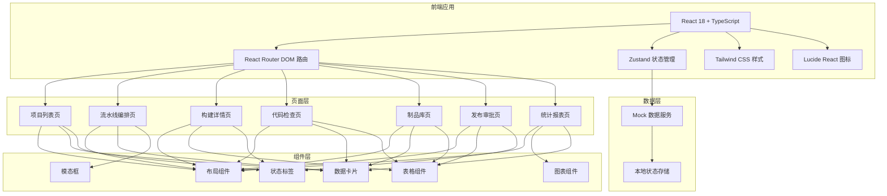
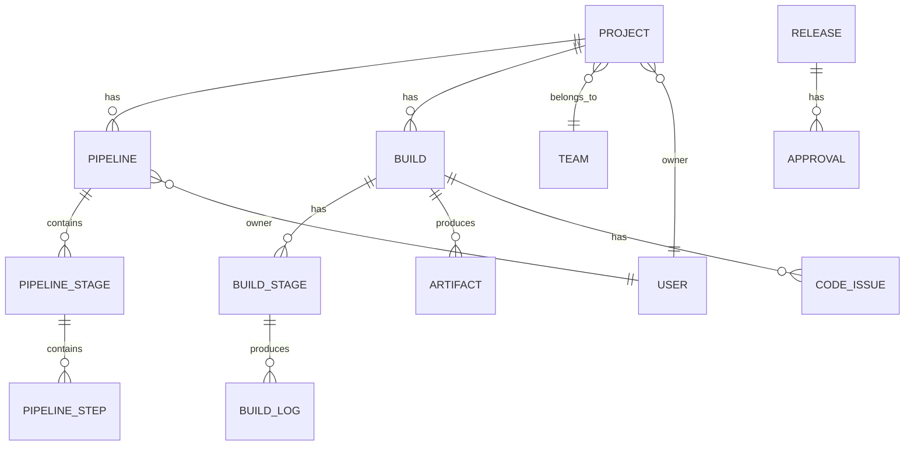

## 1. 架构设计



## 2. 技术描述

- **前端框架**：React 18 + TypeScript
- **构建工具**：Vite 5
- **路由管理**：react-router-dom 6
- **状态管理**：zustand 4
- **样式方案**：Tailwind CSS 3
- **图标库**：lucide-react
- **图表库**：recharts
- **数据来源**：前端 Mock 数据，纯前端实现

## 3. 路由定义

| 路由路径 | 页面名称 | 说明 |
|----------|----------|------|
| / | 项目列表 | 首页，展示所有项目卡片 |
| /projects | 项目列表 | 项目管理主页面 |
| /pipeline/:projectId | 流水线编排 | 可视化配置流水线 |
| /build/:buildId | 构建详情 | 查看构建日志和阶段 |
| /code-review/:buildId | 代码检查 | 代码检查结果和质量门禁 |
| /artifacts | 制品库 | 制品管理和下载 |
| /release | 发布审批 | 发布申请和审批流程 |
| /statistics | 统计报表 | 团队统计和趋势分析 |

## 4. 数据模型

### 4.1 核心数据实体



### 4.2 数据类型定义

```typescript
// 团队
interface Team {
  id: string;
  name: string;
  memberCount: number;
}

// 用户
interface User {
  id: string;
  name: string;
  avatar: string;
  role: 'developer' | 'tester' | 'ops' | 'manager';
  teamId: string;
}

// 项目
interface Project {
  id: string;
  name: string;
  description: string;
  teamId: string;
  ownerId: string;
  repoUrl: string;
  buildCount: number;
  lastBuildStatus: 'success' | 'failed' | 'running' | 'pending';
  lastBuildTime: string;
  createdAt: string;
}

// 流水线
interface Pipeline {
  id: string;
  projectId: string;
  name: string;
  ownerId: string;
  stages: PipelineStage[];
  qualityGate: QualityGate;
}

// 流水线阶段
interface PipelineStage {
  id: string;
  name: string;
  order: number;
  steps: PipelineStep[];
}

// 流水线步骤
interface PipelineStep {
  id: string;
  name: string;
  type: 'build' | 'test' | 'lint' | 'deploy' | 'script';
  script: string;
  timeout: number;
  dependencies: string[];
}

// 质量门禁
interface QualityGate {
  id: string;
  name: string;
  rules: QualityGateRule[];
}

interface QualityGateRule {
  id: string;
  name: string;
  metric: string;
  operator: 'gt' | 'lt' | 'gte' | 'lte' | 'eq';
  threshold: number;
  critical: boolean;
}

// 构建
interface Build {
  id: string;
  projectId: string;
  pipelineId: string;
  status: 'success' | 'failed' | 'running' | 'pending' | 'cancelled';
  triggeredBy: string;
  triggerType: 'manual' | 'push' | 'schedule';
  commitHash: string;
  commitMessage: string;
  startTime: string;
  endTime?: string;
  duration?: number;
  stages: BuildStage[];
}

// 构建阶段
interface BuildStage {
  id: string;
  buildId: string;
  stageName: string;
  status: 'success' | 'failed' | 'running' | 'pending' | 'skipped';
  startTime: string;
  endTime?: string;
  duration?: number;
  logs: BuildLog[];
}

// 构建日志
interface BuildLog {
  id: string;
  stageId: string;
  timestamp: string;
  level: 'info' | 'warn' | 'error' | 'debug';
  message: string;
}

// 代码问题
interface CodeIssue {
  id: string;
  buildId: string;
  file: string;
  line: number;
  severity: 'critical' | 'major' | 'minor' | 'info';
  type: 'bug' | 'vulnerability' | 'code_smell' | 'duplication';
  message: string;
  rule: string;
  status: 'open' | 'fixed' | 'false_positive';
}

// 制品
interface Artifact {
  id: string;
  buildId: string;
  projectId: string;
  name: string;
  version: string;
  size: number;
  type: string;
  uploadTime: string;
  uploader: string;
  downloadUrl: string;
  metadata: Record<string, string>;
}

// 发布申请
interface Release {
  id: string;
  projectId: string;
  artifactId: string;
  title: string;
  description: string;
  applicantId: string;
  status: 'pending' | 'approved' | 'rejected' | 'released';
  approvals: Approval[];
  releaseWindow?: ReleaseWindow;
  createdAt: string;
}

// 审批记录
interface Approval {
  id: string;
  releaseId: string;
  approverId: string;
  level: number;
  status: 'pending' | 'approved' | 'rejected';
  comment: string;
  approvedAt?: string;
}

// 发布窗口
interface ReleaseWindow {
  id: string;
  name: string;
  startTime: string;
  endTime: string;
  description: string;
}

// 统计数据
interface Statistics {
  totalBuilds: number;
  successRate: number;
  avgDuration: number;
  teamStats: TeamStat[];
  dailyBuilds: DailyBuild[];
}

interface TeamStat {
  teamId: string;
  teamName: string;
  buildCount: number;
  successRate: number;
  avgDuration: number;
}

interface DailyBuild {
  date: string;
  count: number;
  successCount: number;
}

// 通知订阅
interface NotificationSubscription {
  id: string;
  userId: string;
  eventType: 'build_failed' | 'release_approved' | 'release_rejected';
  channel: 'email' | 'webhook' | 'in_app';
  target: string;
  enabled: boolean;
}
```

## 5. 目录结构

```
src/
├── components/          # 公共组件
│   ├── layout/         # 布局组件
│   │   ├── Sidebar.tsx
│   │   ├── Header.tsx
│   │   └── AppLayout.tsx
│   ├── common/         # 通用组件
│   │   ├── Button.tsx
│   │   ├── Card.tsx
│   │   ├── StatusBadge.tsx
│   │   ├── Modal.tsx
│   │   ├── Tabs.tsx
│   │   └── SearchInput.tsx
│   └── charts/         # 图表组件
│       ├── BarChart.tsx
│       └── LineChart.tsx
├── pages/              # 页面组件
│   ├── ProjectList/
│   ├── PipelineEditor/
│   ├── BuildDetail/
│   ├── CodeReview/
│   ├── Artifacts/
│   ├── ReleaseApproval/
│   └── Statistics/
├── store/              # 状态管理
│   ├── useProjectStore.ts
│   ├── useBuildStore.ts
│   ├── usePipelineStore.ts
│   └── useAppStore.ts
├── data/               # Mock 数据
│   ├── projects.ts
│   ├── builds.ts
│   ├── pipeline.ts
│   ├── codeIssues.ts
│   ├── artifacts.ts
│   ├── releases.ts
│   └── statistics.ts
├── types/              # 类型定义
│   └── index.ts
├── utils/              # 工具函数
│   ├── format.ts
│   └── date.ts
├── App.tsx
├── main.tsx
└── index.css
```

## 6. 开发规范

### 6.1 组件规范
- 每个组件文件不超过 300 行
- 使用函数组件 + Hooks
- 使用 TypeScript 严格类型
- 组件命名使用 PascalCase

### 6.2 样式规范
- 使用 Tailwind CSS 原子类
- 自定义样式使用 CSS 变量
- 深色主题为主
- 响应式设计：sm, md, lg, xl 断点

### 6.3 状态管理
- 使用 zustand 管理全局状态
- 按模块拆分 store
- 组件内状态使用 useState

### 6.4 数据规范
- 所有数据使用 TypeScript 类型定义
- Mock 数据结构与真实 API 保持一致
- 使用工厂函数生成测试数据
